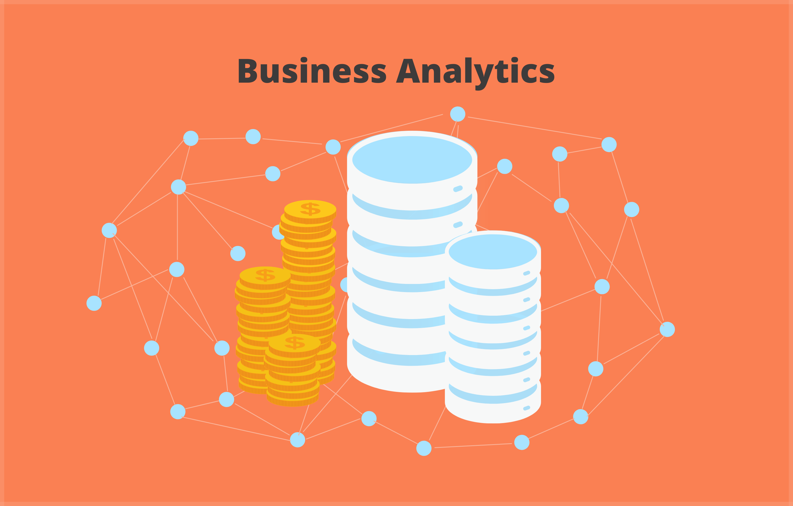

# Business Analytics
*The following repository contains folders of various data science applications in Business Administrations.*

 **Maintenence**  
> In the developing world, it can still be surprising to learn that it is possible to predict maintenance issues before they can cause losses for the business.    
> The notebook focuses on machine learning models and uses them for maintenance issue predictions.
---
 **Customer-Churn** 
> The Case Study focuses on understanding the customer churn rate and its monetary effect on the company. Later it uses other company data to predict multiple 
> scenarios of reducing the churn rate, the profit, and the company resources required for the churn save.
---
 **NASDAQ**  
> The Case Study focuses on data preprocessing and exploratory data analysis of NASDAQ datasets.
---
 **Targeted-Marketing**  
> The case study focuses on Targeting digital marketing using social data and social account connectivity.
---
 **Sales**  
> The case study focuses on sales trends and discusses business decisions that can follow through with data discoveries.
---
 **Deceptive-Reviews**  
> One of the crucial parts of having a growing customer base for the company is being aware of deceptive reviews that can mislead potential customers. 
> Natural Language Processing allows us to analyze large amounts of text and provide details on deceptive reviews with high accuracy. The case study focuses on 
> using NLP to determine if the company requires to provide resources to solve the issue of deceptive reviews.

